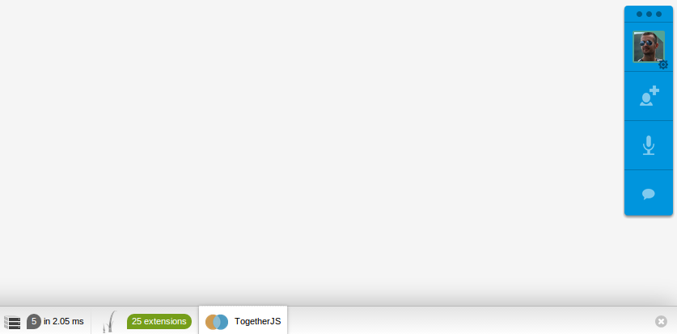

TogetherJsBundle
================
Symfony integration of the awesome [TogetherJS](https://togetherjs.com/) from Mozilla.
#Installation
=============
```bash
composer require pedrotroller/together-js-bundle dev-master@dev
```
```php
class AppKernel extends Kernel
{
    public function registerBundles()
    {
        //...
        if (in_array($this->getEnvironment(), array('dev', 'test'))) {
            //...
            $bundles[] = new PedroTroller\TogetherJs\PedroTrollerTogetherJsBundle();
        }

        return $bundles;
    }
```
#Usage
======

